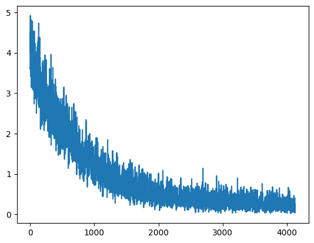

# Thực Tập
## Lí Thuyết
File báo cáo pdf cô đọng các phần lí thuyết đã học trong suốt quá trình thực tập bao gồm các nội dung cơ bản như edge detector, fourier transform,... và tóm tắt ngắn gọn một số bài báo khoa học nổi bật ngày trước đặt nền móng cho sự phát triển của Computer Vision hiện đại.

Cùng với đó là một số file demo nhỏ sử dụng thư viện OpenCV để thực hiện tác vụ xử lý ảnh cơ bản trên.

## Đồ Án Thực Tập

Xây dựng model CLIP tiếng Việt - một model được giới thiệu bởi OpenAI vào năm 2021.

### Giới thiệu qua về CLIP
CLIP (Contrastive Language-Image Pretraining)  được huấn luyện trên một lượng lớn dữ liệu gồm cặp ảnh và văn bản. Mô hình CLIP bao gồm hai encoders, một dùng để encode văn bản và một để encode hình ảnh. Ý tưởng chính của CLIP là tạo một cầu nối có thể liên kết được giữa hai encoders này sau đó tính toán được sự giống nhau giữa văn bản và hình ảnh từ đó dự đoán được cặp văn bản, ảnh nào có khả năng cao đi đôi với nhau nhất.

Một số điểm nổi bật về CLIP:

- Khả năng zero-shot: Mô hình có khả năng thực hiện phân loại hình ảnh (Image classification) mà không cần huấn luyện cụ thể cho tác vụ này.
- Hiệu suất: theo tờ báo khoa học của OpenAI, CLIP có hiệu suất tương đương với mô hình ResNet50 trên bộ dữ liệu ImageNet mà không cần sử dụng bất kỳ dữ liệu huấn luyện nào từ bộ dữ liệu này.
- Ứng dụng: Ngoài phân loại, nhận dạng ảnh, mô hình có thể dùng để thực hiện tìm kiếm ảnh theo văn bản người dùng nhập.

### Về Dữ Liệu
Sử dụng hai bộ dữ liệu là UITViIC và KTVIC:

- UITViIC của trường UIT, chủ yếu là ảnh và caption tiếng việt (chú thích ảnh) về các môn thể thao như tennis, bóng chày, bóng đá,... Nguồn ảnh lấy từ bộ dữ liệu nổi tiếng COCO. Tổng cộng gồm có 2695 ảnh train và 231 ảnh test.
- KTVIC của VNU, cũng là ảnh và caption nhưng mẫu ảnh đa dạng hơn, có thể là ảnh đồ ăn, nhà cửa, xe cộ,... Bộ ảnh gồm 3769 ảnh train và 558 ảnh test.
- Ở cả hai bộ data, mỗi ảnh có thể có một hoặc nhiều captions.
- Tất cả ảnh đều được xử lí theo chuẩn của resnet50 (resize, crop, normalize) và thực hiện data augmentation (random rotation, horizontal flip) để tránh overfit nếu train một ảnh nhiều lần.
- Đối với bộ data của UIT, do captions chưa được word tokenize nên sẽ được pass qua thư viện underthesea để xử lý trước. Điều này là bắt buộc vì mô hình phobert (dùng làm text encoder cho CLIP) chỉ nhận inputs đã đc word tokenize.

### Quá Trình Huấn Luyện
Chia làm bốn giai đoạn chính:
- Khởi động, freeze (đóng băng) lại weights của hai encoders trong khoảng 10 epochs đầu để layer kết nối (projection head) có thời gian thích nghi trước khi train.
- Unfreeze hai encoders và train với bộ dữ liệu KTVIC khoảng 70 epochs. Model nhanh chóng hội tụ sau 3000 batches đầu tiên và gần như không thay đổi 1000 batches tiếp theo.

  
  
- Sau đó tiếp tục train với bộ dữ liệu UITViIC xấp xỉ 120 epochs. Có thể thấy loss dao động mạnh mẽ, lúc thấp lúc cao do gặp dữ liệu chưa thấy bao giờ nhưng cũng hội tụ sau khoảng 5000 batches.
  
  
  
- Cuối cùng, trộn lẫn hai bộ data và train với learning rate nhỏ khoảng 120 epochs nữa để đảm bảo sự hội tụ.

  

### Kết Quả
Thử nghiệm phân loại ảnh với một số prompts:

Prompt: Chơi bóng chày.

Prompt: Có người đang chơi tennis.

Prompt: Có một con thuyền ở dưới nước.

Prompt: Có xe máy ở trên đường.

### Kết Luận

Tuy model đã thành công phân loại được một số hình ảnh nhất định nhưng khi thử nhiều prompts hơn thì có thể dễ thấy độ chính xác còn khá thấp, ví dụ như với prompt "Chơi bóng chày" trên model đã cho ra kết quả khá tốt nhưng chỉ cần đổi thành "Có người chơi bóng chày" độ chính xác lập tức giảm. Điều này là dễ hiểu vì tập huấn luyện chỉ có khoảng 6000 ảnh trong đó có tới hơn nửa là từ bộ dữ liệu KTVIC với chủ đề khá rời rạc. Để cải tiến mô hình này ta cần mở rộng bộ dữ liệu (khá khó khăn vì dữ liệu tiếng việt còn ít) hoặc tiếp tục fine-tune với dữ liệu chủ đề cụ thể hơn như bộ ảnh giao thông đường bộ, bộ ảnh các món ăn,...
